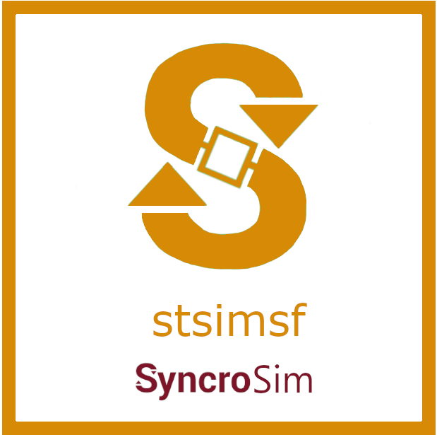

# **stsimsf** SyncroSim Package

    <a href="https://github.com/ApexRMS/stsimsf">
 
## SyncroSim Add-On Package to ST-Sim
### The *stsimsf* package is designed to integrate stocks and flows into state-and-transition simulation models in ST-Sim.

<a href="http://doi.org/10.1111/2041-210X.12597" target="_blank">State-and-transition simulation models</a> (STSMs) are used to forecast landscape dynamics. Using the base SyncroSim package, <a href="https://docs.stsim.net/" target="_blank">*ST-Sim*</a>, you can design models to forecast the change of discrete variables, such as the expansion/contraction of agricultural lands or harvest of tree plantations (see <a href="http://doi.org/10.1111/2041-210X.12597" target="_blank">Daniel, Frid, Sleeter, and Fortin (2016)</a>). Using the ST-Sim Add-On package, *stsimsf*, you can design models to forecast the change of continuous variables as well, such as biomass and carbon fluctuations. For more information on integrating STSMs with stock-flow models, see the paper by <a href="http://doi.org/10.1111/2041-210X.12952" target="_blank">Daniel, Sleeter, Frid, and Fortin (2018)</a>.

## Requirements

This package requires:

* the <a href="https://syncrosim.com/download/" target="_blank">latest version</a> of SyncroSim
* the latest version of <a href="https://docs.stsim.net/" target="_blank">ST-Sim</a>
 
 
## How to Install

Open SyncroSim and select **File -> Packages… -> Install…**, then select the **stsimsf** package and click OK.

Alternatively, download <a href="https://github.com/ApexRMS/stsimsf/releases/" target="_blank">the latest release from Github</a>. Open SyncroSim and navigate to packages, then install from file.
 
 
## Getting Started

For more information on **stsimsf**, including a Quickstart Tutorial, see the <a href="https://docs.stsim.net/" target="_blank">ST-Sim documentation</a>.
 
 
## Links

Browse source code at
[http://github.com/ApexRMS/stsimsf/](http://github.com/ApexRMS/stsimsf/)
 
Report a bug at
[http://github.com/ApexRMS/stsimsf/issues](http://github.com/ApexRMS/stsimsf/issues)
 
 
## Developers

Colin Daniel (Author, maintainer)
 
Ben Sleeter (Author)
 
Alex Embrey (Author)
 
Leonardo Frid (Author) 
